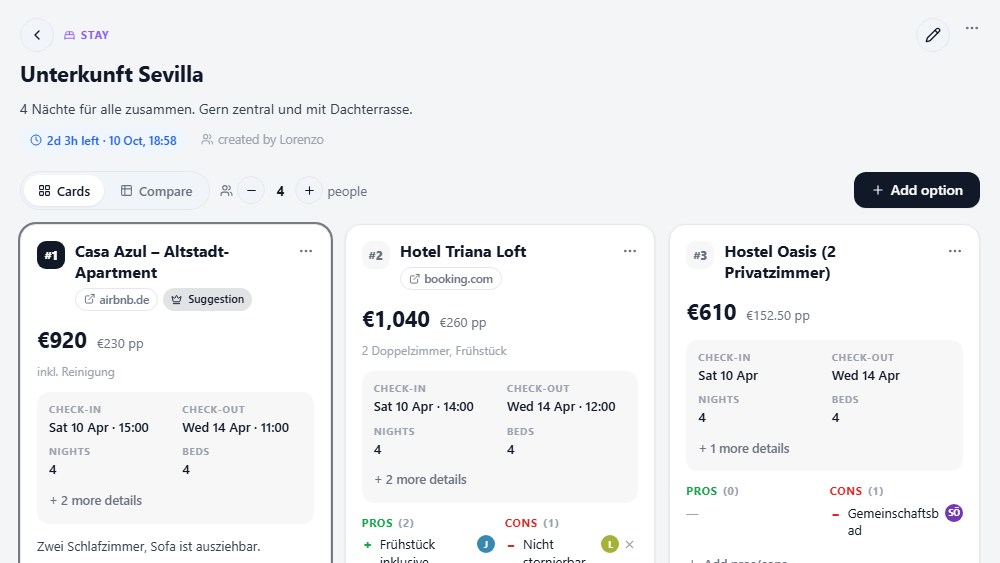

# Entscheidungen — group decisions for TREK

A plugin for the self-hosted travel planner [TREK](https://github.com/liketrek/TREK) that covers the
part of a group trip that happens *before* anything is booked: which apartment, which flight, which
rental car. The group collects options, weighs pros and cons, votes — and the winner becomes a TREK
booking with one click. The plugin's interface is German and English (it follows your TREK language).



## What it does

The plugin adds an **Entscheidungen** (Decisions) tab right after *Plan* in every trip. A decision is
an open question ("Stay in Seville", "Outbound flight") with a category, an optional deadline and any
number of options. Everyone on the trip can add options with a link, a total price and category
details (check-in/out for stays, airports and times for flights, pick-up and return for rental cars),
collect pros and cons, upvote as many options as they like and veto the ones that do not work for
them. Options are ranked by upvotes, cheaper first on a tie, vetoed ones last; who voted for what is
visible to everyone. A comparison table lines the options up side by side, and the price per person is
computed from the number of trip members (the divisor can be changed).

When the group has made up its mind, **Decide** turns the winning option into TREK data: a booking of
the matching type (a stay becomes a hotel booking with an accommodation block on the trip days and a
place on the map; flights get their airports as from/to stops), a cost split equally between the
members you pick, the other options archived and the group notified. Every write runs with the
permissions of the person who clicked, so a missing right or a disabled Costs addon is reported
instead of failing the decision. A passed deadline only marks the vote as ended and highlights the top
option — nothing is ever booked automatically. A decision can be reopened; the plugin then asks
whether the booking it created should be deleted too. All open sessions update live.

Beyond its own tab the plugin shows up natively in TREK: options of open decisions appear as markers
on the trip map, the planner shows a banner when a decision closes within three days, and dashboard
trip cards carry an "open decisions" badge. Prices in a foreign currency are converted into the trip
currency. Pasting a booking link fills in what the link itself carries (stay dates, the hotel name on
Booking.com, map coordinates) — the page is never fetched. Optional extras build on TREK's own
features: posting a decision as a Collab poll and importing its votes, reading a pasted listing with
TREK's AI model, and tools for an assistant connected to TREK's MCP server.

## Screenshots

The decision view is shown above. More previews (light/dark, phone, comparison table, dialogs) can be
generated locally with `npm run shots` while the dev server runs (see *Development*).

## Setup

**Install** (TREK 4.3 or newer, admin account):

1. Download `plugin.zip` from the latest [release](../../releases) of this repository.
2. In TREK open **Admin → Plugins**, drag the zip onto the upload area (or click *Upload*).
3. The plugin is installed inactive: **activate** it and **approve** the permissions listed below.
4. Open any trip — the **Entscheidungen** tab sits right after *Plan*.

There are no settings. To update, upload the newer `plugin.zip` the same way; your data stays.

**Quick start inside a trip**

1. *Neue Entscheidung* → give it a title and a category (stay, flight, train, rental car, activity,
   other), optionally a deadline.
2. *Option hinzufügen* for every candidate. Paste the listing link first — dates and coordinates in the
   link are filled in for you. With an AI model in TREK, *Inserat oder Flugdetails einfügen* reads a
   pasted listing text.
3. Vote with 👍 (as many options as you like) or veto, add pros and cons. *Vergleich* shows a table.
4. *Entscheiden* on the winner: choose booking, cost (and who shares it), archiving and notification.

**Optional TREK features the plugin uses when available**

| Feature | Needs | Enable in TREK |
|---|---|---|
| Costs (cost split) | Costs addon + `budget_edit` on the trip | Admin → Addons |
| Collab poll | Collab addon + `collab_edit` | Admin → Addons |
| AI import | AI Parsing addon with a model (local Ollama, OpenAI or Anthropic) | Admin → Addons → AI Parsing, or per user under Settings → Integrations |
| Assistant tools | an MCP client connected to TREK (static token, or OAuth with the `plugins:use` scope) | Settings → Integrations → MCP |

Bookings need `reservation_edit` (and `place_edit` for the map place of a stay) on the trip.

## Permissions

| Permission | Why |
|---|---|
| `db:own` | Stores decisions, options, pros/cons, votes and a per-trip divisor in the plugin's own SQLite database. |
| `db:read:trips` | Checks trip membership before every request (the own database is not membership-checked), reads the trip's currency, days (to place a stay on trip days) and member list. |
| `db:read:users` | Resolves the trip owner's display name, who is not part of the member list. |
| `ws:broadcast:trip` | Pings the trip's open sessions after a change so every member's view refreshes live. |
| `db:write:reservations` | Creates the booking for the chosen option (and deletes it on request when a decision is reopened). |
| `db:write:places` | Creates a place from the address/coordinates of a chosen stay so the accommodation shows on the map. |
| `db:write:costs` | Adds the chosen option's price as a cost linked to the booking, split between the chosen members. |
| `notify:send` | Notifies the trip members that a decision has been made. |
| `db:read:collab` | Detects whether the Collab addon is available and reads the votes of a poll the plugin posted. |
| `db:write:collab` | Posts a decision's options as a Collab poll (only on request). |
| `rates:read` | Converts prices in a foreign currency into the trip currency. |
| `hook:map-marker-provider` | Shows the options of open decisions that have coordinates as markers on the trip map. |
| `hook:trip-warning-provider` | Shows a planner banner when an open decision closes within three days or its vote has ended. |
| `hook:trip-card-provider` | Adds an "open decisions" badge to the dashboard trip cards. |
| `ai:invoke` | Reads a pasted listing/offer with the AI model configured in TREK to pre-fill the option form (output is only a draft). |
| `mcp:tools` | Publishes three tools (list decisions, create decision, add option) for assistants connected to TREK's MCP server. |
| `hook:user-data` | Deletes and exports a person's votes, pros/cons and authorship when TREK handles an account deletion or data request. |

No outbound network access is requested: the plugin never fetches booking pages.

## Good to know

- **AI import with a local model:** TREK stops a plugin request after 30 seconds. A local model on a
  CPU-only server can take longer; a cloud provider is fast enough.
- **Assistant tools:** TREK does not tell a plugin which user runs an MCP tool, so decisions and
  options created by an assistant are shown as created by the *KI-Assistent*.
- **Account deletion:** the person's votes and pros/cons are removed; shared decisions and options stay
  and show *Gelöschtes Konto* as author.
- **Language of banners, markers and badges:** TREK passes no language to these, so they use the
  language in which someone last opened the trip's tab.

## Development

Requires Node.js 22.5+ (for `node:sqlite`).

```bash
npm install
npm run dev        # dev server: http://localhost:4317/preview (sandboxed frame, light/dark toggle)
npm run seed       # example trip data from dev-fixtures.json into the dev database
npm test           # unit tests (createMockHost + real SQLite)
npm run validate   # TREK plugin checks
npm run build      # plugin.zip, the file you upload to TREK
```

With the dev server running: `npm run test:ui` clicks through the main flow in the preview frame and
`npm run shots` writes screenshots to `.trek-dev/shots/` (both need `npx playwright install chromium`
once). `npm run build:airports` refreshes the bundled airport table from OurAirports (public domain).

Layout: `server/` is the plugin's server code (`lib/routes.js` HTTP routes, `lib/booking.js` the
decide → booking/cost mapping, `lib/hooks.js` map/banner/badge, `lib/mcp.js`, `lib/ai.js`,
`lib/gdpr.js`), `client/index.html` the whole UI (vanilla JS on the TREK design kit), `test/` the
unit tests, `scripts/` dev tooling. `.claude/skills/trek-plugin-dev` is the official TREK plugin skill
for AI coding agents.

**Releasing:** `npm run version:set -- 1.2.3`, commit, then `git tag v1.2.3 && git push --follow-tags`.
The *Release* GitHub Action runs the tests, builds `plugin.zip` and attaches it to a GitHub release.
The *CI* action runs the tests on every push and keeps the built zip as a workflow artifact.

## License

MIT — see [LICENSE](LICENSE).
